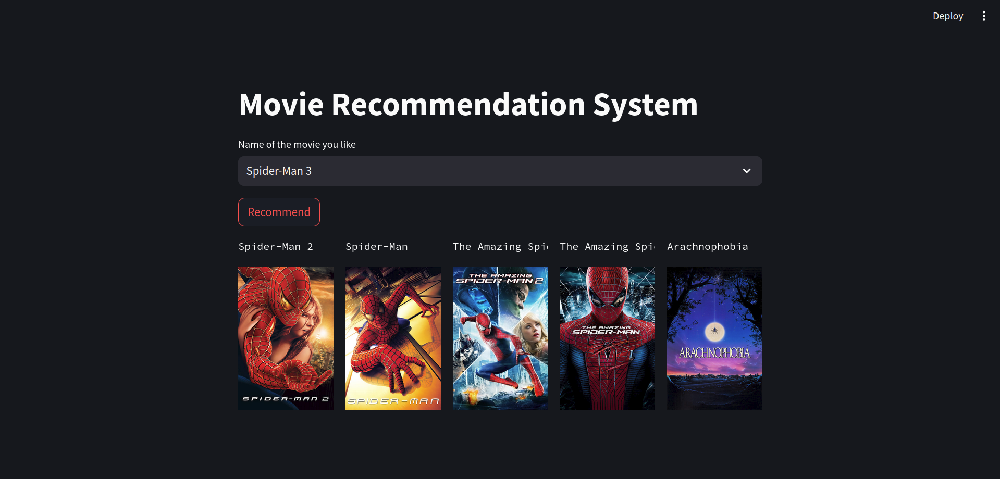

# Movie-Recommendation-System
Just a recommendation system that recommends the movies according to the like of your input movie

### Pros
- Has good recommendation according to the input movie
- Recommends 5 similar movies
- Has web based application which shows image of the recommended movies

### Cons
- Little outdated data will update soon
- Will add description and details(director,actors,box office and so on) of the movies 

# Installation
1. To run in local 
        1. `` pip install -r requirements.txt ``
        2. ``python -u main.py``
2. To run webbased app 
	1. ``Complete step 1 then``
	2. ``pip install streamlit``
	3. ``pip install requests``
	then
	4. ``streamlit run app.py``

